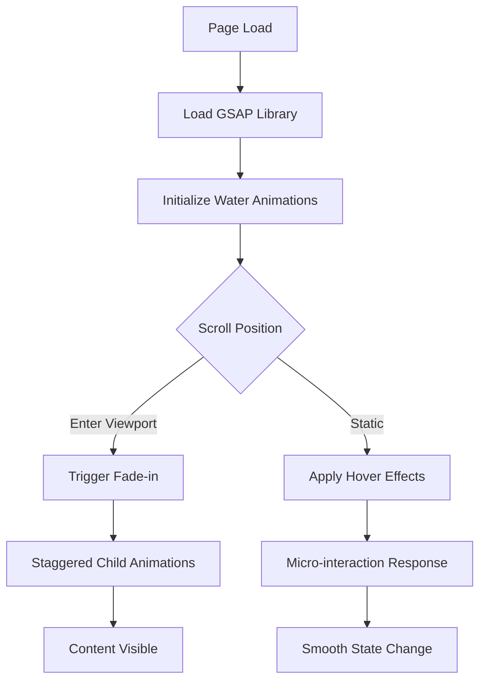

# SGDA Frontend Modernization Plan - Water-Inspired UI

## Overview
Modernize the existing SGDA Java web application frontend with water-inspired animations, smooth transitions, and professional UI while respecting the constraint of NO frameworks (React, Vue, htmx, Alpine, etc.).

## Technology Stack

### Animation Library Selection
**Selected: GSAP (GreenSock Animation Platform)**
- Reasons:
  - Pure JavaScript, no framework dependencies
  - Exceptional performance with `requestAnimationFrame`
  - Built-in spring/ease animations
  - ScrollTrigger plugin for scroll-based animations
  - Small footprint with custom builder (only include what's needed)
  - Used by professionals (NASA, Apple, Adobe)

Alternative: Anime.js (lighter but fewer features)

### CSS Approach
- Enhance existing `app.css` (2500 lines) with water-themed variables
- Use CSS custom properties for theming
- Implement fluid transitions with `cubic-bezier()` and spring curves

## Color Palette (Water-Inspired)

```css
:root {
    /* Water Base Colors */
    --water-deep: #0a4d8c;
    --water-mid: #1e90ff;
    --water-light: #87ceeb;
    --water-foam: #e0f7fa;
    --water-aqua: #7fffd4;
    --water-teal: #008080;
    --water-ocean: #006994;
    
    /* Enhanced Existing Palette */
    --primary: #0a4d8c;
    --primary-light: #1e90ff;
    --primary-dark: #063d6e;
    --accent: #7fffd4;
    --success: #2e8b57;
    --danger: #dc3545;
    --warning: #ffc107;
    --info: #17a2b8;
    
    /* Water Gradient */
    --gradient-water: linear-gradient(135deg, #0a4d8c 0%, #1e90ff 50%, #7fffd4 100%);
    --gradient-water-soft: linear-gradient(180deg, #e0f7fa 0%, #ffffff 100%);
    
    /* Transitions */
    --transition-water: all 0.4s cubic-bezier(0.25, 0.46, 0.45, 0.94);
    --transition-spring: all 0.5s cubic-bezier(0.68, -0.55, 0.265, 1.55);
    --transition-fluid: all 0.3s ease-in-out;
}
```

## Animation Strategy

### 1. Micro-interactions
- **Buttons**: Ripple effect on click, scale(1.05) on hover
- **Cards**: Subtle lift with box-shadow transition
- **Navigation items**: Water-like underline animation
- **Form inputs**: Focus glow effect with water color

### 2. Page Transitions
- Fade-in with slight upward movement on page load
- Smooth scroll between sections
- Water-wave effect for content reveals

### 3. Scroll Animations (GSAP ScrollTrigger)
- Elements fade in as they enter viewport
- Staggered animations for lists
- Parallax effects for background elements

### 4. Loading States
- Water ripple loading animation
- Smooth skeleton screens

## Implementation Plan

### Phase 1: Foundation (Files to Create/Modify)
1. **Update `src/main/webapp/assets/css/app.css`**
   - Add water-themed CSS variables
   - Create animation utility classes
   - Enhance existing components with transitions

2. **Create `src/main/webapp/assets/js/water-animations.js`**
   - GSAP initialization
   - ScrollTrigger setup
   - Micro-interaction handlers
   - Water ripple effect
   - Page transition controller

3. **Create `src/main/webapp/assets/js/gsap-loader.js`**
   - Dynamic loading of GSAP from CDN
   - Only load ScrollTrigger if needed
   - Fallback for offline mode

### Phase 2: Component Enhancement
4. **Update navbar** (`header.jsp`)
   - Smooth dropdown animations
   - Water-gradient background
   - Animated hamburger menu

5. **Update sidebar** (`header.jsp`)
   - Slide-in with spring animation
   - Active indicator with fluid movement
   - Hover effects on nav items

6. **Enhance cards and tables**
   - Staggered fade-in on load
   - Hover lift effects
   - Smooth row highlighting

### Phase 3: Page-Specific Animations
7. **Dashboard pages**
   - Animated stat counters
   - Chart animations (if using charts)
   - Smooth card reveals

8. **Form pages**
   - Step-by-step form animations
   - Input validation feedback
   - Success/error animations

### Phase 4: Performance & Polish
9. **Optimize performance**
   - Use `will-change` sparingly
   - Debounce scroll handlers
   - Use `requestAnimationFrame`
   - Lazy load animations

10. **Test responsiveness**
    - Mobile touch interactions
    - Reduced motion media query
    - Cross-browser testing

## File Structure
```
src/main/webapp/
├── assets/
│   ├── css/
│   │   └── app.css (modify - add water theme)
│   └── js/
│       ├── app.js (existing - keep)
│       ├── water-animations.js (new)
│       └── gsap-loader.js (new)
└── WEB-INF/
    └── views/
        └── common/
            ├── header.jsp (modify - add animation classes)
            └── footer.jsp (modify - include GSAP scripts)
```

## GSAP Integration (CDN Approach)
```html
<!-- In footer.jsp, before </body> -->
<script>
    // Load GSAP dynamically
    (function() {
        var script = document.createElement('script');
        script.src = 'https://cdnjs.cloudflare.com/ajax/libs/gsap/3.12.5/gsap.min.js';
        script.onload = function() {
            // Load ScrollTrigger
            var scrollScript = document.createElement('script');
            scrollScript.src = 'https://cdnjs.cloudflare.com/ajax/libs/gsap/3.12.5/ScrollTrigger.min.js';
            scrollScript.onload = function() {
                gsap.registerPlugin(ScrollTrigger);
                // Initialize water animations
                if (window.initWaterAnimations) {
                    window.initWaterAnimations();
                }
            };
            document.head.appendChild(scrollScript);
        };
        document.head.appendChild(script);
    })();
</script>
<script src="${pageContext.request.contextPath}/assets/js/water-animations.js"></script>
```

## Water Animation Examples

### Ripple Effect (CSS)
```css
.ripple {
    position: relative;
    overflow: hidden;
}

.ripple::after {
    content: '';
    position: absolute;
    width: 100%;
    height: 100%;
    top: 0;
    left: 0;
    pointer-events: none;
    background-image: radial-gradient(circle, rgba(255,255,255,0.4) 10%, transparent 10%);
    background-repeat: no-repeat;
    background-position: 50%;
    transform: scale(10,10);
    opacity: 0;
    transition: transform 0.5s, opacity 0.5s;
}

.ripple:active::after {
    transform: scale(0,0);
    opacity: 0.3;
    transition: 0s;
}
```

### GSAP Water Float Animation
```javascript
// Gentle floating animation like bobbing on water
gsap.to('.water-float', {
    y: -10,
    duration: 2,
    ease: 'sine.inOut',
    yoyo: true,
    repeat: -1
});
```

## Accessibility Considerations
- Respect `prefers-reduced-motion` media query
- Provide fallbacks for no JavaScript
- Maintain focus indicators
- Use `aria-live` for dynamic content

## Next Steps
1. Review this plan
2. Switch to Code mode for implementation
3. Start with CSS variables and utility classes
4. Add GSAP and create animation controllers
5. Enhance each JSP page incrementally

## Mermaid Diagram - Animation Flow


## Estimated File Changes
- **Modify**: `app.css` (add ~200 lines)
- **Create**: `water-animations.js` (~300 lines)
- **Create**: `gsap-loader.js` (~50 lines)
- **Modify**: `header.jsp` (add classes)
- **Modify**: `footer.jsp` (add script tags)
- **Modify**: All JSP views (add animation classes as needed)
